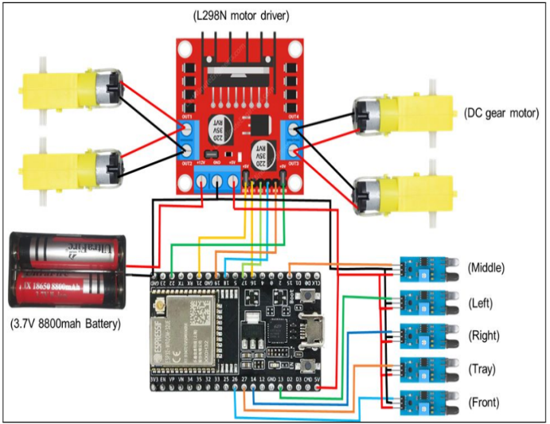
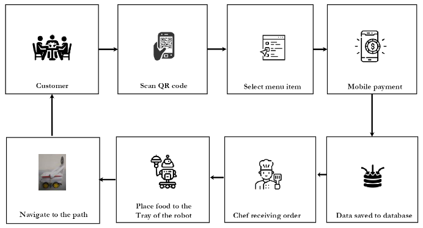

# RoboServe: Design and Implementation of a Robotic Agent for Serving Food at Restaurants

**IoT-Based Restaurant Robot with Efficient Algorithms**

## Project Overview
This project focuses on developing an IoT-driven robotic system to efficiently serve food in restaurants. By leveraging advanced algorithms and sensors, RoboServe ensures smooth and seamless service.

---

## Circuit Diagram
Below is the circuit diagram of the project for a better understanding of the hardware setup:

---

## Conceptual Flow
The conceptual flow diagram showcases the workflow of the robotic system:

---

## How to Use
1. Clone the repository.
2. Upload the firmware to the Arduino and ESP32 boards.
3. Follow the circuit diagram to assemble the hardware components.
4. Run the Python script for system control and monitoring.
